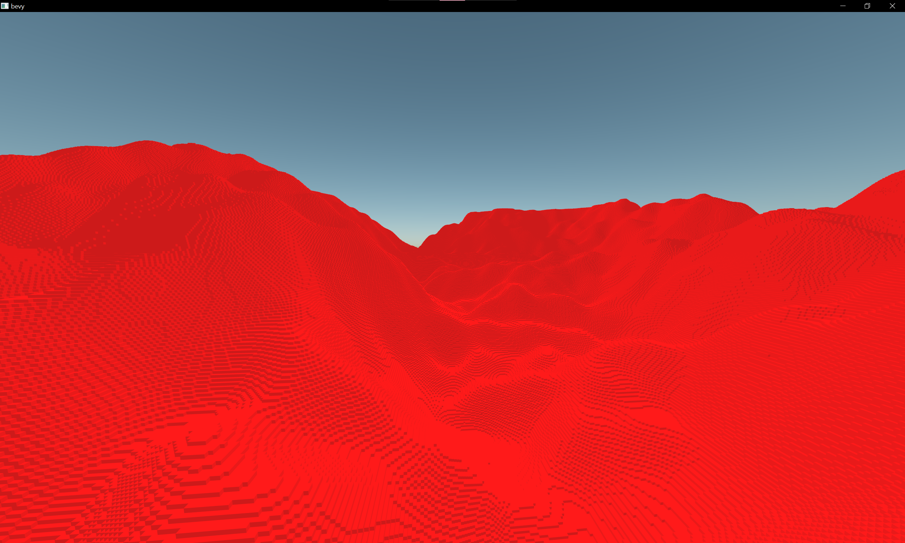
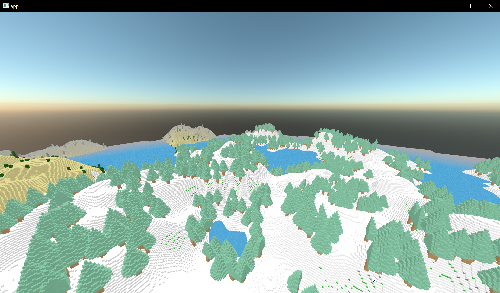
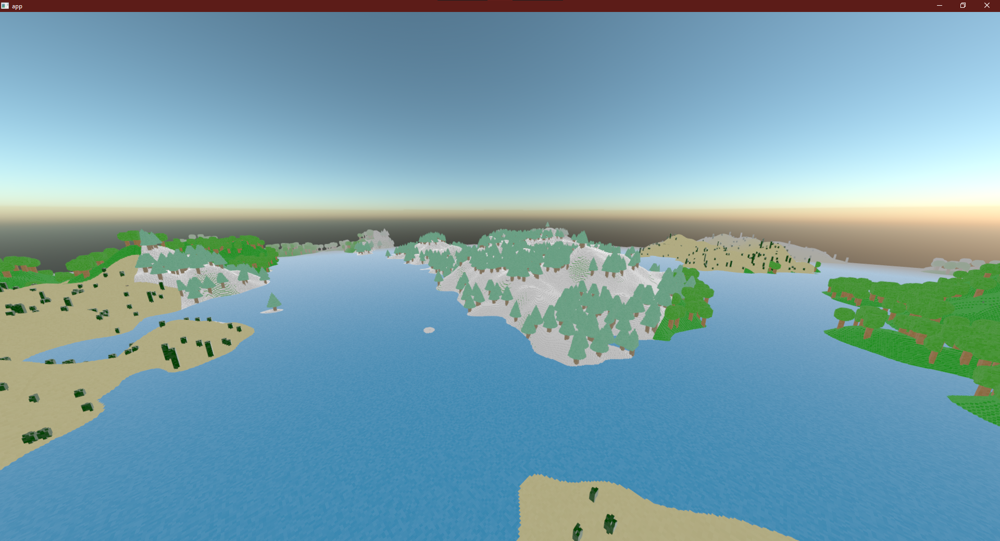

# `vx_bevy`

A minecraft-esque voxel engine rendering prototype made using the Bevy game engine.

Chunk are rendered using a triangle mesh per chunk. Chunks are greedily meshed.

Meshing and generation tasks are using bevy's `AsyncComputeTaskPool` to dispatch tasks across frame to prevent frame stuttering.

Performance is okayish (~100fps on a 1060 + 8th gen intel on release mode) with default render distance (16 chunks) altough mesh stitching could allow this to go even higher up.

Also don't go under the world.

## Screenshots

https://user-images.githubusercontent.com/20256717/180202640-6135373b-4c58-482c-820f-3660a8755e2d.mp4

## Acknowledgments

This uses the awesome [block-mesh](https://github.com/bonsairobo/block-mesh-rs) crate which handles greedy meshing.
