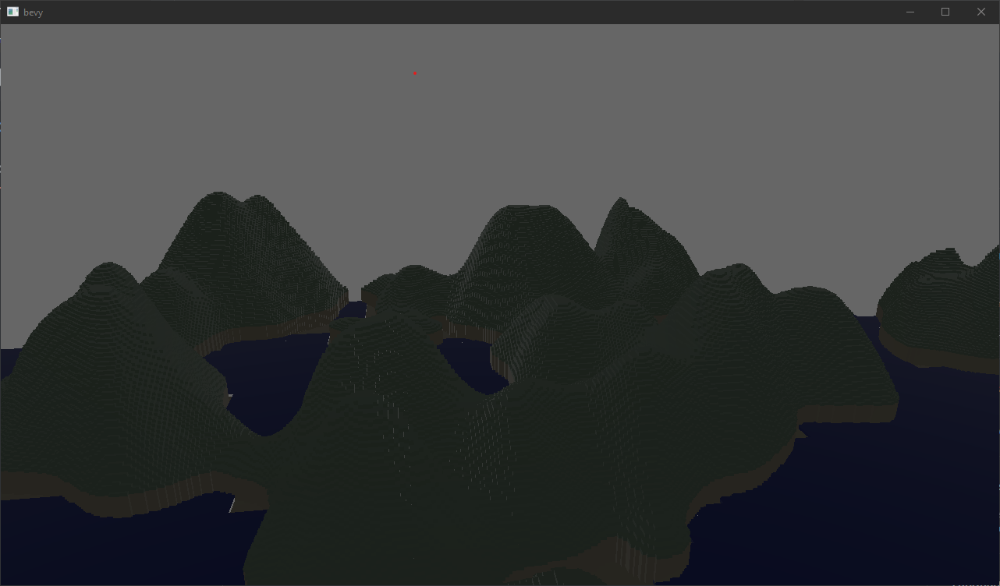

# `vx_bevy`

A WIP voxel engine made using the Bevy game engine.

## Features (this is still a big WIP)
- Very basic worldgen (no complex structures)
- Animated chunk loading (ala cube world)
- Crashes often because we can't handle panic when entities don't exist in bevy yet :' (  
- Performance is okayish